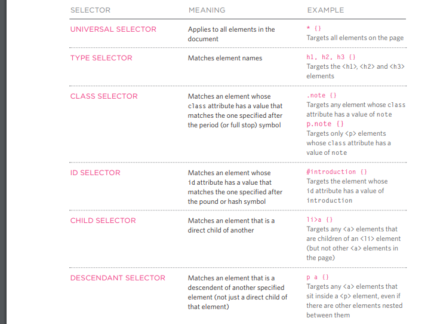
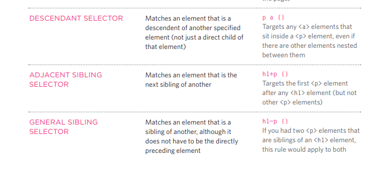
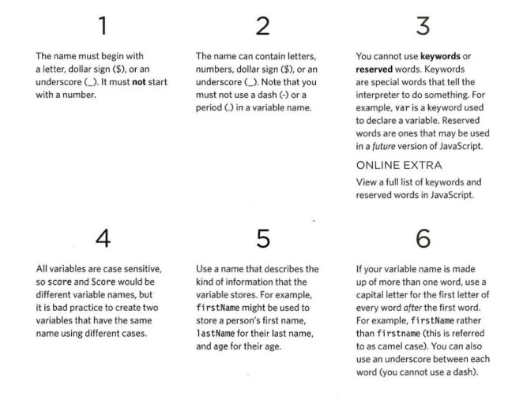

# Readings : Basics of HTML, CSS & JS

## i understand that tags e tags provide extra meaning and allow browsers to show users the appropriate structure for the page there is two type of markup :
* Structural markup: the elements that you can use to
describe both headings and paragraphs
* Semantic markup: which provides extra information; but if we detelte them nothing will happen

## tags in html:
* heading: there is `<h1>` to `<h6>`
* Paragraphs: `
` we use this tag to write text inside it
* bold: `<b>` we use the tag to make the font more thick
* italic: `<i>` we use the tag to make the text italics
* superscript:The `` element is usedto contain characters that should be superscript 
* subscript:The `` element is used to contain characters that shouldbe subscript. 
* break line : ` ` to add a line break in the code that dispaly in browser
* horizontal rules: `
` To create a break between themes you can add a horizontal rule between sections
* Strong: `<strong>`element indicates that its content has strong importance. 
* Emphasis:The `<em>` element indicates emphasis that subtly changes the meaning of a sentence
* blockquote:the `<blockquote>` element is used for longer quotes that take up an entire paragraph
* quote:The `<q>` element is used forshorter quotes that sit within a paragraph
* Abbreviations: `<abbr>`   the optional title attribute can provide an expansion or description for the   abbreviation
* citations :when you want to referencing book or paper search `<cite>` element can be used to indicate where the citation is from.
* definitions: we use `<dfn>` when we want to explain new concept
 * `<address>`:The  element hasquite a specific use: to contain contact details for the author of the page.
* `<ins>`:The  element can be used to show content that has been inserted into a document
* `<del>`: the element can show text that has been deleted from it.
* `<s>`:The element indicates something that is no longer accurate or relevant 

### white space it is appear on the browser to make code easy to read

### Code views show you the code created by the visual editor so
you can manually edit it, or so you can just enter new code yourself 

### visual editor : is computer software for editing text files using a textual or graphical user interface which displays the content (text) in an easy to look at and good view; 

# CSS note:
### The key to understanding how CSS works is toimagine that there is an invisible box around every HTML element.

## CSS rule :contains two parts: a selector and a declaration
`p>>Selector{font-family: Arial; >> Declaration}`
* Selectors indicate which element the rule applies to
* Declarations indicate how the elements referred to in the selector should be styled. 
* CSS declarations sit inside curly brackets and each is made up of two parts: a property and a value.
* link :we use the link to connect between css file and html document and link conain attributes (href,type,rel)

* herf:This specifies the path to the CSS file 
* type:This attribute specifies the type of document being linked to
* rel:This specifies the relationship between the HTML page and
the file it is linked to. 
* `<style>`:this tag allows us to write css inside the html file or inside the tags
* the best way to add css is in external file because it has many benefit such as the rule can be apply to more than one page 

### css selector

## javascript note :
*  script : is a series of instructions that a computer can follow one-by-one. 
* statement: Each individual instruction or step should end with a semicolon

* comments: to explain what your code does, help make your code easier to read and understand:
`//` for one line comment
`/* */` for multiple line comment

* variables : to assign data in it to use them later (var) and we declare it through the kayword var then the name of the variables then we assign the value (`var age= 22 ;`)

* there is more than one data type such as (string>> 'yazan' , number >> 22, boolean>>true)

* array: is a special type of variable. It doesn't just store one value; it stores a list of values. 
`var colors =new Array('white ' ,'black','custom'); `
* the numbring in array start from zero not one in the list we can access and modify the values in array
 
#### there is two type of expression  one we use it to assing value  to variable and the other we use it to combine more than one value to return it in to single value : 
* `var color = 'beige'`;
* `var area = 3 * 2`;
##### there is two types or operators arthmatic and logical
* (+,-,*,/,%,...) arthmatic
* (and , or , not) logical 

* the code can take more than one path so we need to control the data flow to know wich path the code will select we have to evaluate and decide then use loops when it is nessary , the flow chart can help us to make decisions 

### the components of decisions :
* expression
* conditional statement

### types comparison operator:
* `==` : equal to this operator compare two values if they are the same
* `!=`: not equal to this operator compare two values if they are not the same
* `===` : strict equal to this operator compare two values to check that both of the values are the same in the data type and the value
* `!==` : strict not equal to this operator compare two values to check that both of the values are not the same in the data type and the value
* `(>)` : greater than this operator check if the number in the left greater than the number in the right
* `<` : less than this operator check if the number in the left less than the number in the right
* `<=` : less than or equal this operator check if the number in the left less than or equal the number in the right
* `>=` : greater than or equal this operator check if the number in the left greater than the number in the right

### logical operator:
* `&&` : and this operator test more than one conditon
* `or` : this operator test at least one condition
* `!` : not this operator take the value of boolean and then inverts it

### in any condition it will be one operand and two operatorwe can combine more than one condition through logical operator and we can compare more than on expression in on statement through logical operator

### switch statements :a starts with avariable called the switch value.
Each case indicates a possible value for this variable and the
code that should run if the variable matches that value.

~~~~var level = 2;
switch (level) {
case 1:
msg = 'Good luck on the first test ' ;
break;
case 2:
msg = 'Second of three - keep going!';
break;
case 3:
msg = ' Final round, al most there!';
break;
default :
msg = 'Good l uck!';
break;
}
~~~~

## rules of naming variables 

